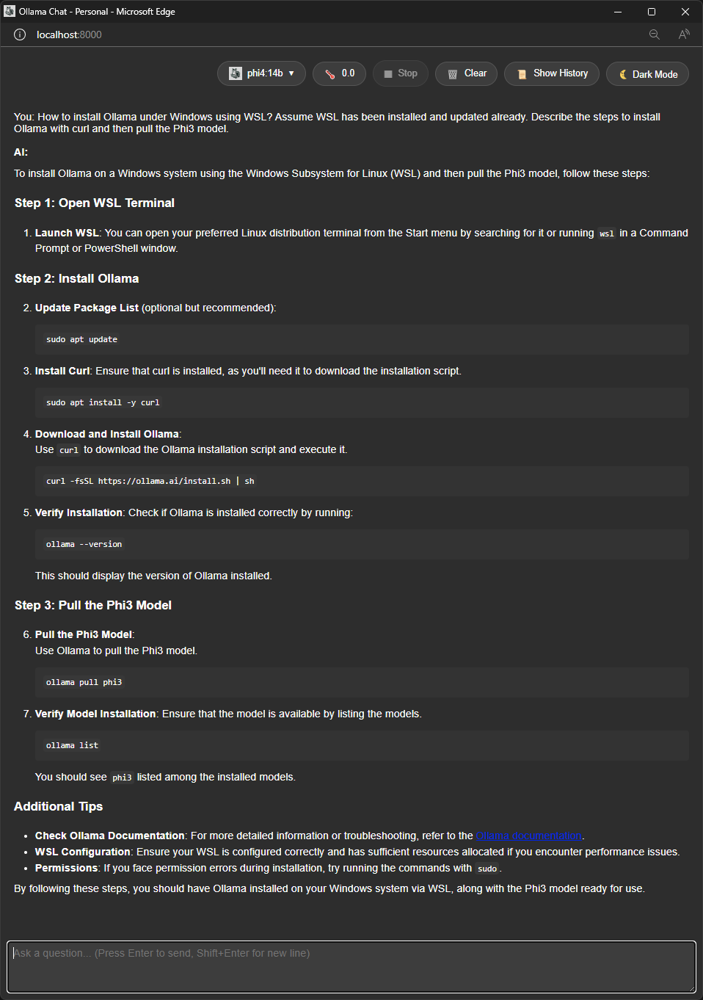

# Ollama Basic UI
Very simple UI for Ollama that supports a simple history, model selection, and dark and light mode. Written in HTML and JS, so only a webserver needed to run it.

The assumption is that you are running Ollama on Linux or WSL under Windows already and have pulled a few models.



# Start HTTP server

If you're running this locally, you should use a local development server instead of opening the HTML file directly in the browser. You can use Python's built-in server or Node.js's http-server.

Using Python 3:
```bash
# Navigate to your project directory
python -m http.server 8000
```

Using Node.js (after installing http-server):
```bash
# Install http-server globally
npm install -g http-server

# Navigate to your project directory
http-server
```

Using Docker:
```bash
# build docker container
sudo docker build . -t python_httpd

# start docker container detached
sudo docker run --rm -d -p 4242:4242 python_httpd
```

# Running Ollama with Docker

To run Ollama with the Gemma3 1B model using Docker:

```bash
# Pull and run Ollama container
docker run --rm -d -v ollama:/root/.ollama -p 11434:11434 --name ollama ollama/ollama

# Pull the Gemma 3B model
docker exec ollama ollama pull gemma3:1b

# Run the model
docker exec ollama ollama run gemma3:1b
```

# List of Ollama models

https://ollama.com/search
